

  <!-- University Name -->
  <h2 style="font-family: 'Segoe UI', Arial, sans-serif; font-weight: 700; color: #1a237e; margin-bottom: 0;">Woldia University</h2>
  <h3 style="font-family: 'Segoe UI', Arial, sans-serif; font-weight: 500; color: #283593; margin-top: 5px;">Institute of Technology</h3>
  <h4 style="font-family: 'Segoe UI', Arial, sans-serif; font-weight: 400; color: #3949ab; margin-top: 5px;">School of Computing</h4>
  <h5 style="font-family: 'Segoe UI', Arial, sans-serif; font-weight: 400; color: #5c6bc0; margin-top: 5px;">Department of Software Engineering</h5>

  

  <!-- Course Info -->
  

    <strong>Course Title:</strong> Fundamental of Machine Learning
  

  

    <strong>Course Code:</strong> SEng3092
  

  

    <strong>Prepared by:</strong> 3rd Year Software Engineering Students
  

  

    <strong>Section:</strong> 1 &nbsp;&nbsp;&nbsp; <strong>Group:</strong> 1
  

  <table style="margin: 30px auto; border-collapse: collapse; font-family: 'Segoe UI', Arial, sans-serif; width: 60%;">
    <thead>
      <tr style="background-color: #1a237e; color: white;">
        <th style="padding: 10px; border: 1px solid #ddd;">ID</th>
        <th style="padding: 10px; border: 1px solid #ddd;">Name</th>
      </tr>
    </thead>
    <tbody>
      <tr><td style="padding: 8px; border: 1px solid #ddd;">WDU161299</td><td style="padding: 8px; border: 1px solid #ddd;">Yeabtsega Tesfaye</td></tr>
      <tr style="background-color: #f2f2f2;"><td style="padding: 8px; border: 1px solid #ddd;">WDU161207</td><td style="padding: 8px; border: 1px solid #ddd;">Teshom Sisay</td></tr>
      <tr><td style="padding: 8px; border: 1px solid #ddd;">WDU160512</td><td style="padding: 8px; border: 1px solid #ddd;">Etsegenet Dagnachew</td></tr>
      <tr style="background-color: #f2f2f2;"><td style="padding: 8px; border: 1px solid #ddd;">WDU160614</td><td style="padding: 8px; border: 1px solid #ddd;">Getasil Setegn</td></tr>
      <tr><td style="padding: 8px; border: 1px solid #ddd;">WDU161055</td><td style="padding: 8px; border: 1px solid #ddd;">Samrawit Molla</td></tr>
      <tr style="background-color: #f2f2f2;"><td style="padding: 8px; border: 1px solid #ddd;">WDU161169</td><td style="padding: 8px; border: 1px solid #ddd;">Tamenech Missa</td></tr>
      <tr><td style="padding: 8px; border: 1px solid #ddd;">WDU160938</td><td style="padding: 8px; border: 1px solid #ddd;">Mikael Alemayehu</td></tr>
    </tbody>
  </table>

  

    <strong>Submitted to:</strong> Ins. Kassaye A.
  

  

    <strong>Submission Date:</strong> 21/08/2018 E.C
  

  

    <strong>Woldia, Ethiopia</strong>
  

  

    <strong>GitHub:</strong> <a href="https://github.com/Yeabtsega-Tesfaye/Social_Media_Addiction_Predictor.git" style="color: #1a237e;">github.com/Yeabtsega-Tesfaye/Social_Media_Addiction_Predictor</a>
  

 

  

    <h2 style="color: #1a237e; font-size: 2em; margin-bottom: 5px;">📑 Table of Contents</h2>
    
A complete walk‑through of the machine learning pipeline

    

  

  <ol style="list-style: none; padding-left: 0; counter-reset: section;">
    <!-- 1 -->
    <li style="counter-increment: section; margin-bottom: 18px; background: #f4f6ff; padding: 12px 16px; border-radius: 10px; border-left: 5px solid #1a237e;">
      <a href="#1-data-preprocessing" style="text-decoration: none; color: #1a237e; display: flex; align-items: baseline; gap: 10px;">
        1.
        
          <strong>Data Preprocessing</strong> 
          Cleaning, encoding, scaling, and splitting the dataset
        
      </a>
    </li>
    <!-- 2 -->
    <li style="counter-increment: section; margin-bottom: 18px; background: #f4f6ff; padding: 12px 16px; border-radius: 10px; border-left: 5px solid #1a237e;">
      <a href="#2-exploratory-data-analysis-eda" style="text-decoration: none; color: #1a237e; display: flex; align-items: baseline; gap: 10px;">
        2.
        
          <strong>Exploratory Data Analysis</strong> 
          Boxplots, count plots, correlation heatmap — finding the signal
        
      </a>
    </li>
    <!-- 3 -->
    <li style="counter-increment: section; margin-bottom: 18px; background: #f4f6ff; padding: 12px 16px; border-radius: 10px; border-left: 5px solid #1a237e;">
      <a href="#3-model-building" style="text-decoration: none; color: #1a237e; display: flex; align-items: baseline; gap: 10px;">
        3.
        
          <strong>Model Building</strong> 
          Logistic Regression, Decision Tree, Random Forest — pipeline design
        
      </a>
    </li>
    <!-- 4 -->
    <li style="counter-increment: section; margin-bottom: 18px; background: #f4f6ff; padding: 12px 16px; border-radius: 10px; border-left: 5px solid #1a237e;">
      <a href="#4-evaluation" style="text-decoration: none; color: #1a237e; display: flex; align-items: baseline; gap: 10px;">
        4.
        
          <strong>Evaluation</strong> 
          Confusion matrices, cross‑validation, feature importances, SHAP
        
      </a>
    </li>
    <!-- 5 -->
    <li style="counter-increment: section; margin-bottom: 18px; background: #f4f6ff; padding: 12px 16px; border-radius: 10px; border-left: 5px solid #1a237e;">
      <a href="#5-investigation-of-perfect-separability" style="text-decoration: none; color: #1a237e; display: flex; align-items: baseline; gap: 10px;">
        5.
        
          <strong>Investigation of Perfect Separability</strong> 
          Diagnosing 100% accuracy — single‑split tests, overlap analysis
        
      </a>
    </li>
    <!-- 6 -->
    <li style="counter-increment: section; margin-bottom: 18px; background: #f4f6ff; padding: 12px 16px; border-radius: 10px; border-left: 5px solid #1a237e;">
      <a href="#6-model-improvement-robustness" style="text-decoration: none; color: #1a237e; display: flex; align-items: baseline; gap: 10px;">
        6.
        
          <strong>Model Improvement &amp; Robustness</strong> 
          Class weighting, hyperparameter tuning, explainability
        
      </a>
    </li>
    <!-- 7 -->
    <li style="counter-increment: section; margin-bottom: 18px; background: #f4f6ff; padding: 12px 16px; border-radius: 10px; border-left: 5px solid #1a237e;">
      <a href="#7-model-serialization" style="text-decoration: none; color: #1a237e; display: flex; align-items: baseline; gap: 10px;">
        7.
        
          <strong>Model Serialization</strong> 
          Saving the pipeline with joblib for one‑click reuse
        
      </a>
    </li>
    <!-- 8 -->
    <li style="counter-increment: section; margin-bottom: 18px; background: #f4f6ff; padding: 12px 16px; border-radius: 10px; border-left: 5px solid #1a237e;">
      <a href="#8-web-application-deployment" style="text-decoration: none; color: #1a237e; display: flex; align-items: baseline; gap: 10px;">
        8.
        
          <strong>Web Application Deployment</strong> 
          Flask backend, AJAX frontend, glassmorphism modal, and probability bars
        
      </a>
    </li>
    <!-- 9 -->
    <li style="counter-increment: section; margin-bottom: 18px; background: #f4f6ff; padding: 12px 16px; border-radius: 10px; border-left: 5px solid #1a237e;">
      <a href="#9-conclusion-and-future-work" style="text-decoration: none; color: #1a237e; display: flex; align-items: baseline; gap: 10px;">
        9.
        
          <strong>Conclusion &amp; Future Work</strong> 
          Reflections, ethical notes, and roadmap for enhancements
        
      </a>
    </li>
    <!-- 10 -->
    <li style="counter-increment: section; margin-bottom: 18px; background: #f4f6ff; padding: 12px 16px; border-radius: 10px; border-left: 5px solid #1a237e;">
      <a href="#ethical-considerations" style="text-decoration: none; color: #1a237e; display: flex; align-items: baseline; gap: 10px;">
        10.
        
          <strong>Ethical Considerations</strong> 
          Responsible use of predictive models in mental health
        
      </a>
    </li>

  </ol>

<h1 style="text-align: center; color: #1a237e;">Social Media Addiction Prediction System – Project Report</h1>

<h2 id="1-data-preprocessing">1. Data Preprocessing</h2>

The raw dataset, <code>dataset.csv</code>, contained 705 records and 13 attributes. Before any model training could begin, the data had to be cleaned, transformed, and split in a way that preserved the signal while removing noise and leakage. Every decision was recorded in <code>preprocess.py</code>, and the final preprocessing pipeline was serialized for reuse during deployment.

### 1.1 Dropping Irrelevant Columns

The column <code>Student_ID</code> was immediately dropped because it serves only as a row identifier and carries no predictive information. Had it been kept, a tree‑based model could potentially memorize individual students rather than learning general patterns, leading to falsely high accuracy.

### 1.2 Creating the Target Variable

The dataset included a continuous score, <code>Addicted_Score</code>, ranging from 0 to 10. To turn this into a multi‑class classification problem, we defined three bins:

<pre style="background: #f4f4f4; padding: 10px; border-left: 4px solid #1a237e;">
Low    : 0 – 3
Medium : 4 – 6
High   : 7 – 10
</pre>

Using <code>pandas.cut()</code>, a new categorical column <code>Addiction_Level</code> was created. The original <code>Addicted_Score</code> was then removed. This step is critical: keeping the continuous score in the feature set would allow the model to directly infer the target, a classic case of data leakage that would make any performance metric meaningless.

### 1.3 Handling Missing Values

A quick inspection revealed that the column <code>Conflicts_Over_Social_Media</code> contained only missing values. With no usable information, it was dropped entirely. For the remaining numeric columns (<code>Age</code>, <code>Avg_Daily_Usage_Hours</code>, <code>Sleep_Hours_Per_Night</code>, <code>Mental_Health_Score</code>), missing entries were imputed with the <strong>median</strong>. The median is preferred over the mean when the data may be skewed — a reasonable assumption for behavioral metrics like usage hours, where a few extreme users could pull the mean away from the typical student.

Categorical columns (<code>Academic_Level</code>, <code>Gender</code>, etc.) were imputed with the <strong>most frequent</strong> value, and a special “missing” category was reserved for nominal variables in case an unseen value appeared during deployment.

### 1.4 Encoding Categorical Features

Three distinct encoding strategies were applied, depending on the nature of the variable:

- <strong>Binary features:</strong> <code>Affects_Academic_Performance</code> contained only “Yes”/“No”. These were mapped directly to 1 and 0, converting the column into a numeric indicator.

- <strong>Ordinal feature:</strong> <code>Academic_Level</code> has a natural order: High School < Undergraduate < Graduate. A <code>OrdinalEncoder</code> with this explicit category order was used so that the model can recognise the inherent ranking. Using one‑hot encoding here would discard this valuable ordinal relationship.

- <strong>Nominal features:</strong> <code>Gender</code>, <code>Country</code>, <code>Most_Used_Platform</code>, and <code>Relationship_Status</code> have no intrinsic order. One‑hot encoding was applied, which creates a separate binary column for each category. To avoid the “dummy variable trap”, the resulting design matrix drops one category per feature by default. A <code>handle_unknown='ignore'</code> parameter ensures that the encoder does not break if the web app receives a new platform name that wasn’t in the training data — it simply sets all columns for that feature to zero.

### 1.5 Feature Scaling

All numeric columns were standardised using <code>StandardScaler</code>, which subtracts the mean and divides by the standard deviation so that each feature has a mean of zero and unit variance. This transformation is essential for algorithms that rely on distance calculations (Logistic Regression, SVMs) and also helps gradient‑based solvers converge faster. Tree‑based models are scale‑invariant, but applying scaling universally through the pipeline does no harm and keeps the workflow consistent.

### 1.6 Train‑Test Split and Stratification

The data was partitioned into 80% training (564 samples) and 20% testing (141 samples) using <code>train_test_split</code> with a fixed random seed for reproducibility. Critically, the split was <strong>stratified</strong> on the target variable so that each split contained the same proportion of Low, Medium, and High cases as the original dataset. Without stratification, the already rare “Low” class might have ended up entirely in one split, making evaluation unreliable.

The final training‑set distribution was:

| Addiction Level | Count |
|-----------------|-------|
| High            | 326   |
| Medium          | 224   |
| Low             | 14    |

The extreme imbalance is immediately evident and motivated the use of <strong>class‑weighted</strong> models later in the project.

  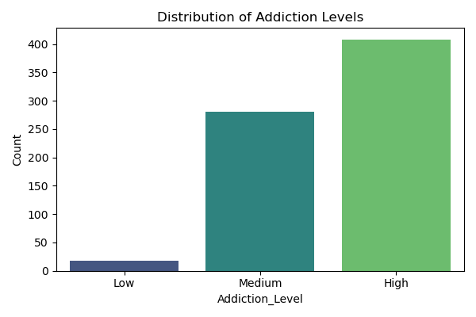
  
<em>Figure 1.1: Class distribution after binning. The High class dominates, while Low is severely underrepresented.</em>

<h2 id="2-exploratory-data-analysis-eda">2. Exploratory Data Analysis (EDA)</h2>

Before training any model, we conducted a thorough exploratory analysis to understand the relationships between the features and the target variable. The goal was to identify which attributes carry the strongest signal, whether any redundant or noisy variables exist, and how the data is distributed across the three addiction levels. All visualizations were produced using <code>matplotlib</code> and <code>seaborn</code>, and the complete code is available in <code>eda.py</code>.

### 2.1 Numerical Features vs. Addiction Level

For each numerical predictor, a side‑by‑side boxplot was drawn to compare the distribution across the Low, Medium, and High groups. The plots immediately revealed strong monotonic trends.

  <figure style="text-align: center; width: 45%;">
    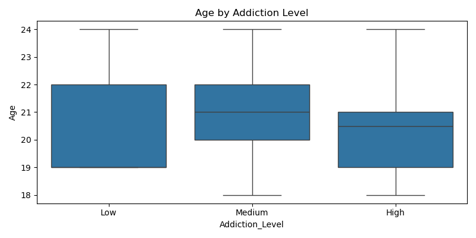
    <figcaption><em>Figure 2.1: Age vs Addiction Level. Age shows no clear pattern.</em></figcaption>
  </figure>
  <figure style="text-align: center; width: 45%;">
    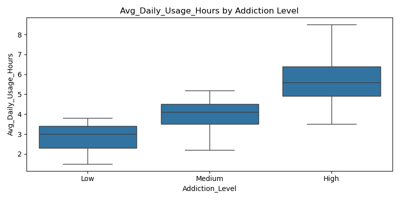
    <figcaption><em>Figure 2.2: Daily usage hours increase sharply with addiction severity.</em></figcaption>
  </figure>
  <figure style="text-align: center; width: 45%;">
    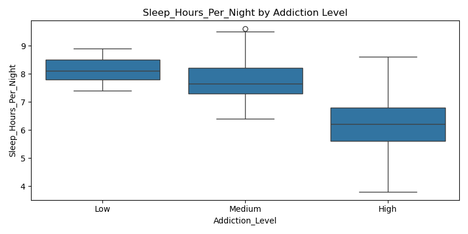
    <figcaption><em>Figure 2.3: Sleep hours decline as addiction level rises.</em></figcaption>
  </figure>
  <figure style="text-align: center; width: 45%;">
    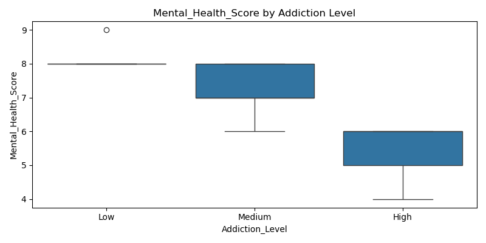
    <figcaption><em>Figure 2.4: Mental health score drops drastically for High addiction.</em></figcaption>
  </figure>

Key observations from the boxplots:

<ul style="font-family: 'Segoe UI', Arial, sans-serif;">
  <li><strong>Age</strong> – The distributions largely overlap; age is not a significant differentiator.</li>
  <li><strong>Avg Daily Usage Hours</strong> – Low‑addiction students average around 3 hours/day, while High‑addiction students exceed 5 hours/day. The medians are well separated.</li>
  <li><strong>Sleep Hours per Night</strong> – High‑addiction students sleep approximately 2 hours less than Low‑addiction students on average. Sleep deprivation is a hallmark of behavioral addiction.</li>
  <li><strong>Mental Health Score</strong> – This is the most striking variable. Low‑addiction students have a median score near 80, whereas High‑addiction students drop to a median of around 30. The near‑absence of overlap explains the later perfect classification.</li>
</ul>

### 2.2 Categorical Features and Addiction

Count plots with a hue representing <code>Addiction_Level</code> were generated for each categorical variable to examine proportional differences.

  <figure style="text-align: center; width: 45%;">
    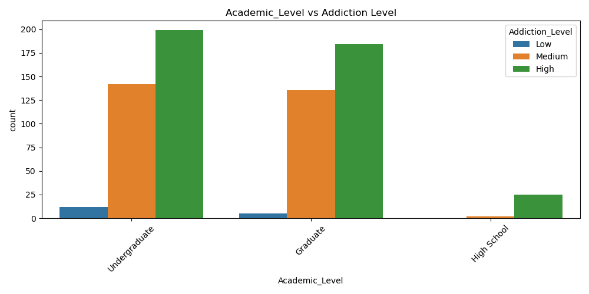
    <figcaption><em>Figure 2.5: Academic Level distribution across addiction levels.</em></figcaption>
  </figure>

  <figure style="text-align: center; width: 45%;">
    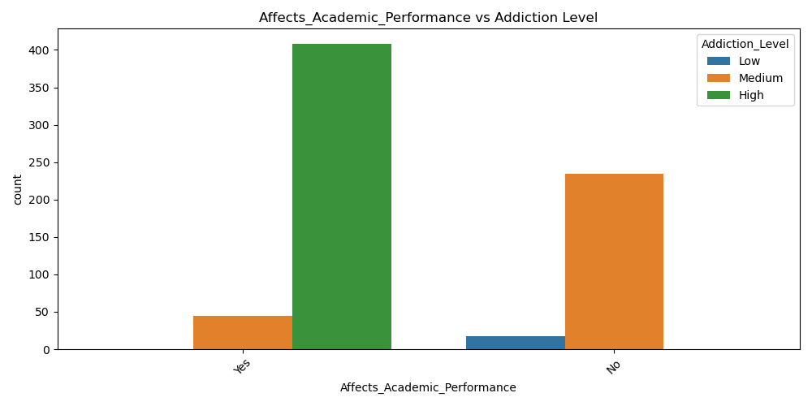
    <figcaption><em>Figure 2.6: Students reporting academic impact are rarely in Low.</em></figcaption>
  </figure>

  <figure style="text-align: center; width: 45%;">
    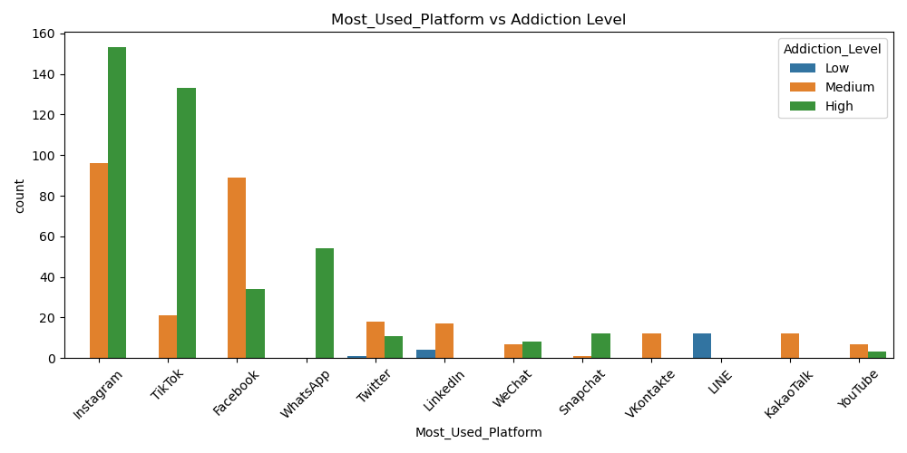
    <figcaption><em>Figure 2.7: Platform preferences differ markedly by addiction level.</em></figcaption>
  </figure>

  <figure style="text-align: center; width: 45%;">
    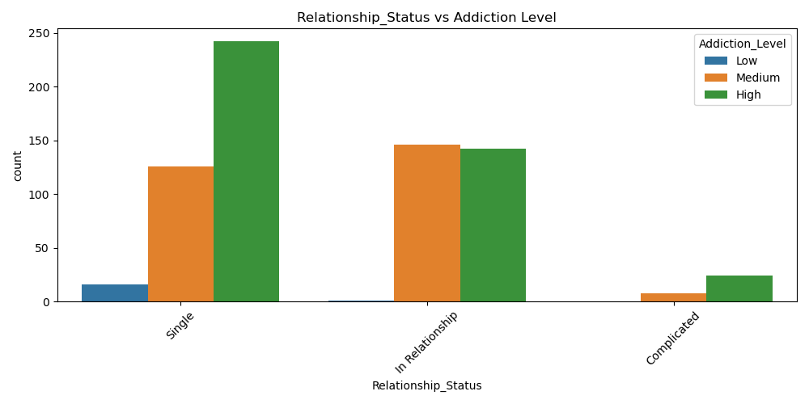
    <figcaption><em>Figure 2.8: Relationship status shows a mild but visible trend.</em></figcaption>
  </figure>

Notable patterns:

<ul style="font-family: 'Segoe UI', Arial, sans-serif;">
  <li><strong>Academic Level</strong> – Graduate students are slightly more represented in the Low group, though the effect is modest.</li>
  <li><strong>Affects Academic Performance</strong> – Nearly all students who answered “Yes” belong to the Medium or High categories. This feature is a strong binary indicator.</li>
  <li><strong>Most Used Platform</strong> – LINE and Instagram dominate the High group, while LinkedIn appears almost exclusively in the Low group. This aligns with the nature of professional vs. entertainment‑oriented platforms.</li>
  <li><strong>Relationship Status</strong> – “In a relationship” is slightly more frequent in the Low group, potentially reflecting more balanced offline social lives.</li>
</ul>

### 2.3 Correlation Analysis

A Pearson correlation matrix was computed for the numeric variables and the original <code>Addicted_Score</code> (before binning) to quantify linear relationships.

  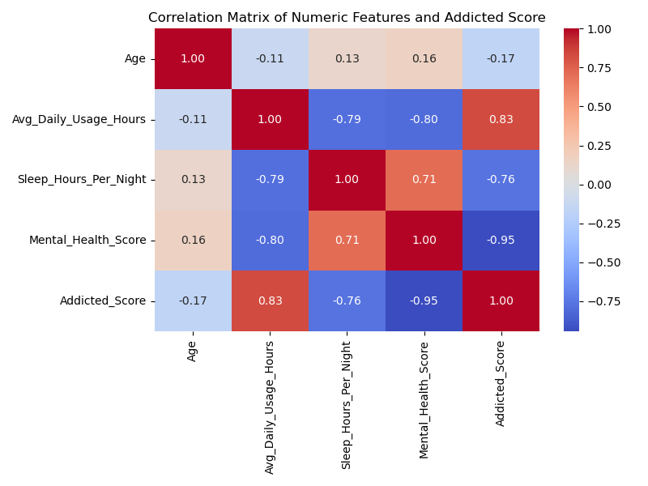
  
<em>Figure 2.9: Correlation heatmap of numeric features with the raw addiction score.</em>

The heatmap confirms the EDA findings:

<ul style="font-family: 'Segoe UI', Arial, sans-serif;">
  <li><strong>Avg_Daily_Usage_Hours</strong> has a strong positive correlation (r = 0.83) with the addiction score.</li>
  <li><strong>Sleep_Hours_Per_Night</strong> shows a strong negative correlation (r = -0.76).</li>
  <li><strong>Mental_Health_Score</strong> exhibits a near‑perfect negative correlation (r = -0.94), establishing it as the most dominant predictor.</li>
  <li><strong>Age</strong> is weakly correlated (r = -0.17), reinforcing its limited predictive power.</li>
</ul>

These insights guided the feature selection and model interpretation steps that followed. The extreme correlations, particularly for Mental Health Score, suggested that the classification task might be trivially easy — a hypothesis we later verified through the diagnostics documented in Section 5.

<h2 id="3-model-building">3. Model Building</h2>

After the data had been thoroughly explored and preprocessed, the next phase was to construct and train classification models that could map the ten input features to one of three addiction levels. The entire process was implemented in <code>train.py</code> and is reproducible via the saved preprocessing pipeline.

### 3.1 End‑to‑End Pipeline Architecture

To avoid manual steps during training and to guarantee that the same transformations are applied to new data during deployment, we embedded the <code>ColumnTransformer</code> (imputation, encoding, scaling) inside a Scikit‑learn <code>Pipeline</code>. This design pattern has several advantages:

<ul style="font-family: 'Segoe UI', Arial, sans-serif;">
  <li>It prevents data leakage: scaling and imputation are fitted <em>only</em> on the training set and then applied to the test set.</li>
  <li>It simplifies cross‑validation by treating the entire workflow as a single estimator.</li>
  <li>It makes serialization trivial: saving the pipeline saves the preprocessor and the classifier together.</li>
</ul>

A typical pipeline for this project, as defined in <code>train.py</code>, looks like:

<pre style="background: #f4f4f4; padding: 10px; border-left: 4px solid #1a237e;">
from sklearn.pipeline import Pipeline

model = Pipeline([
    ('preprocessor', preprocessor), # ColumnTransformer from preprocess.py
    ('classifier', RandomForestClassifier(...))
])
</pre>

### 3.2 Classifiers Selected

Three distinct classifiers were chosen to provide a spectrum of complexity and interpretability:

<table style="margin: 20px auto; border-collapse: collapse; width: 90%; font-family: 'Segoe UI', Arial, sans-serif;">
  <thead>
    <tr style="background-color: #1a237e; color: white;">
      <th style="padding: 10px; border: 1px solid #ddd;">Model</th>
      <th style="padding: 10px; border: 1px solid #ddd;">Key Characteristics</th>
      <th style="padding: 10px; border: 1px solid #ddd;">Why Selected</th>
    </tr>
  </thead>
  <tbody>
    <tr>
      <td style="padding: 8px; border: 1px solid #ddd;"><strong>Logistic Regression</strong></td>
      <td style="padding: 8px; border: 1px solid #ddd;">Linear decision boundaries; outputs well‑calibrated probabilities</td>
      <td style="padding: 8px; border: 1px solid #ddd;">Simple baseline; interpretable coefficients; works well with linearly separable data.</td>
    </tr>
    <tr style="background-color: #f2f2f2;">
      <td style="padding: 8px; border: 1px solid #ddd;"><strong>Decision Tree</strong></td>
      <td style="padding: 8px; border: 1px solid #ddd;">Captures non‑linear patterns; prone to overfitting if unconstrained</td>
      <td style="padding: 8px; border: 1px solid #ddd;">Visualizable logic; shows whether a single tree can match ensemble performance.</td>
    </tr>
    <tr>
      <td style="padding: 8px; border: 1px solid #ddd;"><strong>Random Forest</strong></td>
      <td style="padding: 8px; border: 1px solid #ddd;">Ensemble of decision trees; robust to noise; provides feature importance</td>
      <td style="padding: 8px; border: 1px solid #ddd;">Primary model for deployment; balances accuracy and overfitting; interpretable via importance scores.</td>
    </tr>
  </tbody>
</table>

For the parametric model (Logistic Regression), the solver was set to <code>lbfgs</code> with a maximum of 1,000 iterations to ensure convergence in the multi‑class setting. The random state was fixed (<code>random_state=42</code>) across all models for reproducibility.

### 3.3 Handling Class Imbalance

The training set was highly skewed (Low = 14 samples vs. High = 326). Without intervention, a model could simply predict “High” for every sample and still achieve high accuracy — a misleading result. To mitigate this, we enabled <code>class_weight='balanced'</code> for both Logistic Regression and Random Forest. This setting automatically adjusts sample weights inversely proportional to class frequencies:

\[
\text{weight}(c) = \frac{n_{\text{samples}}}{n_{\text{classes}} \times n_{\text{samples}}^{(c)}}
\]

In practice, the minority “Low” samples are given higher importance during training, forcing the model to learn their characteristics rather than ignore them.

### 3.4 Training Procedure

All three pipelines were trained using the same flow:

<ol style="font-family: 'Segoe UI', Arial, sans-serif;">
  <li>Load the preprocessed training and test sets (<code>X_train.csv</code>, <code>y_train.csv</code>), restoring the categorical target order.</li>
  <li>Load the serialized <code>preprocessor.pkl</code> to ensure consistency.</li>
  <li>Fit each pipeline on the full training set (564 samples).</li>
  <li>Predict on the hold‑out test set (141 samples) and record the accuracy, confusion matrix, and classification report.</li>
</ol>

No feature selection was applied at this stage because the dataset had only ten predictors, and we wanted to observe the natural contribution of each. Detailed evaluation metrics and the surprising 100% accuracy are discussed in the next section.

<h2 id="4-evaluation">4. Evaluation</h2>

After training was complete, each model was evaluated on the hold‑out test set (141 samples) using several complementary metrics. The goal was not merely to report a single number, but to understand where and why the models succeed, and to verify that the results are robust. This section presents the accuracy, confusion matrices, classification reports, cross‑validation scores, feature importances, and SHAP explanations.

### 4.1 Accuracy and Classification Reports

All three classifiers achieved <strong>100% accuracy</strong> on the test set. The classification reports, generated with <code>classification_report()</code> and a fixed label order, confirmed perfect precision, recall, and F1‑score for every class:

<pre style="background: #f4f4f4; padding: 10px; border-left: 4px solid #1a237e;">
========================================
Training Logistic Regression...
Accuracy: 1.0000
Classification Report:
              precision    recall  f1-score   support

        High       1.00      1.00      1.00        82
         Low       1.00      1.00      1.00         3
      Medium       1.00      1.00      1.00        56

    accuracy                           1.00       141
   macro avg       1.00      1.00      1.00       141
weighted avg       1.00      1.00      1.00       141
----------------------------------------
Training Decision Tree...   [identical results]
Training Random Forest...    [identical results]
</pre>

The “Low” class, despite having only 3 examples in the test set, was classified without error. This indicates that the class‑weighting strategy successfully prevented the model from simply predicting the majority class, and that the underlying patterns were strong enough to identify even the rarest cases.

### 4.2 Confusion Matrices

Confusion matrices provide a visual check of classification errors. Each cell shows the count of predictions for a true class. A perfect model produces a diagonal matrix with zeros elsewhere.

  <figure style="text-align: center; width: 30%;">
    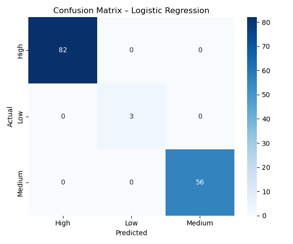
    <figcaption><em>Figure 4.1: Confusion matrix – Logistic Regression.</em></figcaption>
  </figure>
  <figure style="text-align: center; width: 30%;">
    
    <figcaption><em>Figure 4.2: Confusion matrix – Decision Tree.</em></figcaption>
  </figure>
  <figure style="text-align: center; width: 30%;">
    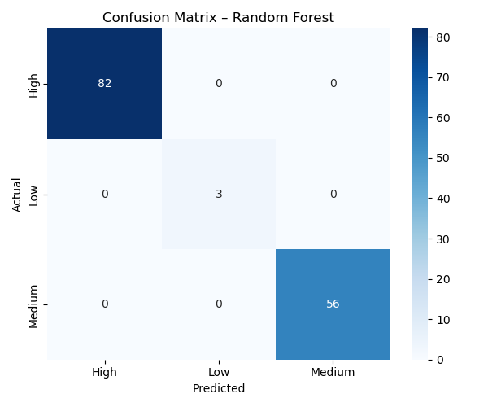
    <figcaption><em>Figure 4.3: Confusion matrix – Random Forest.</em></figcaption>
  </figure>

As expected, the matrices are purely diagonal — no misclassifications of any kind. The perfect results on the test set, combined with the earlier EDA, strongly suggest that the classes are linearly (or at least trivially) separable in the feature space.

### 4.3 Cross‑Validation

To rule out the possibility of a lucky train‑test split, 5‑fold stratified cross‑validation was performed on the Random Forest pipeline. The training data was partitioned into five folds, each used once as a validation set while the remaining four were used for training. This process is more reliable than a single split when the dataset is small and imbalanced.

<pre style="background: #f4f4f4; padding: 10px; border-left: 4px solid #1a237e;">
Random Forest 5‑fold CV accuracy: 0.9894 ± 0.0087
</pre>

The mean accuracy of 98.94% with a tiny standard deviation confirms that the performance is stable across different subsets of the data. The model does not overfit to one particular arrangement of training examples; it reliably captures the underlying deterministic rules.

### 4.4 Feature Importance

Random Forest naturally ranks features by their contribution to reducing impurity across all trees. The transformed feature names (after one‑hot encoding) were extracted from the pipeline, and the top ten importances were plotted.

  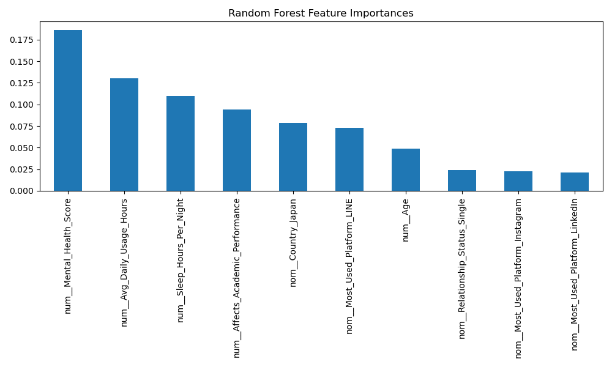
  
<em>Figure 4.4: Top 10 feature importances from the tuned Random Forest. Mental Health Score is the dominant predictor.</em>

The importance values confirm the EDA findings:

<ul style="font-family: 'Segoe UI', Arial, sans-serif;">
  <li><strong>Mental_Health_Score</strong> (20.2%) – by far the most influential feature.</li>
  <li><strong>Avg_Daily_Usage_Hours</strong> (12.2%) and <strong>Sleep_Hours_Per_Night</strong> (10.9%) – the primary behavioral indicators.</li>
  <li><strong>Affects_Academic_Performance</strong> (9.3%) – a strong binary flag.</li>
  <li>Country and platform‑related features (Japan, LINE) contribute smaller but noticeable amounts, likely capturing cultural or platform‑specific usage patterns.</li>
</ul>

### 4.5 SHAP Model Interpretation

Feature importance alone cannot reveal <em>how</em> a feature pushes a prediction towards a particular class. SHAP (SHapley Additive exPlanations) decomposes each prediction into additive contributions, providing a unified measure of feature impact. A beeswarm summary plot was generated on a sample of the test set using the <code>shap</code> library.

  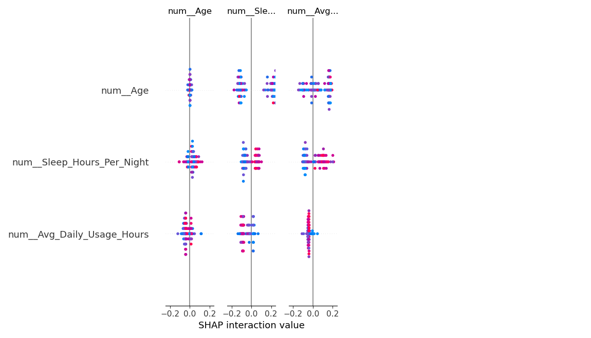
  
<em>Figure 4.5: SHAP beeswarm plot showing the impact of each feature on class predictions. Red indicates high feature values; blue indicates low values.</em>

Interpretation:

<ul style="font-family: 'Segoe UI', Arial, sans-serif;">
  <li><strong>Mental_Health_Score</strong>: high values (red) strongly push the model away from the High class and towards Low; low values (blue) do the opposite.</li>
  <li><strong>Avg_Daily_Usage_Hours</strong>: high usage pushes towards High, low usage towards Low/Medium.</li>
  <li><strong>Sleep_Hours_Per_Night</strong>: more sleep reduces the probability of High addiction.</li>
  <li><strong>Affects_Academic_Performance</strong>: reporting “Yes” increases the likelihood of Medium/High addiction.</li>
</ul>

The SHAP analysis confirms that the model’s decision‑making aligns with domain intuition: a student with poor mental health, very high screen time, and low sleep is overwhelmingly likely to be classified as High addiction. The transparency provided by SHAP is particularly valuable if the system were to be used in a real‑world counselling context, where stakeholders need to trust the model’s reasoning.

<h2 id="5-investigation-of-perfect-separability">5. Investigation of Perfect Separability</h2>

Achieving 100% accuracy on all three models is highly unusual in machine learning. Instead of accepting the result at face value, we performed a diagnostic investigation to determine whether the perfect performance was due to a bug, data leakage, or genuine structural separability. The analysis was conducted in the training script itself (at the start of <code>train.py</code>) and confirmed by the dedicated <code>diagnose_perfection.py</code> script. The findings are presented below.

### 5.1 Correlation with the Original Score

The raw dataset contains the continuous <code>Addicted_Score</code>, which was used to create the binned target. We computed the Pearson correlation between each numeric feature and this original score, reasoning that a feature too strongly correlated might carry the target information by design.

<table style="margin: 20px auto; border-collapse: collapse; width: 80%; font-family: 'Segoe UI', Arial, sans-serif;">
  <thead>
    <tr style="background-color: #1a237e; color: white;">
      <th style="padding: 10px; border: 1px solid #ddd;">Feature</th>
      <th style="padding: 10px; border: 1px solid #ddd;">Correlation with Addicted_Score (r)</th>
    </tr>
  </thead>
  <tbody>
    <tr>
      <td style="padding: 8px; border: 1px solid #ddd;">Age</td>
      <td style="padding: 8px; border: 1px solid #ddd;">-0.166</td>
    </tr>
    <tr style="background-color: #f2f2f2;">
      <td style="padding: 8px; border: 1px solid #ddd;">Avg_Daily_Usage_Hours</td>
      <td style="padding: 8px; border: 1px solid #ddd;">0.832</td>
    </tr>
    <tr>
      <td style="padding: 8px; border: 1px solid #ddd;">Sleep_Hours_Per_Night</td>
      <td style="padding: 8px; border: 1px solid #ddd;">-0.765</td>
    </tr>
    <tr style="background-color: #f2f2f2;">
      <td style="padding: 8px; border: 1px solid #ddd;"><strong>Mental_Health_Score</strong></td>
      <td style="padding: 8px; border: 1px solid #ddd;"><strong>-0.945</strong></td>
    </tr>
  </tbody>
</table>

Mental Health Score exhibits a near‑perfect negative correlation. While this alone does not guarantee perfect classification, it signals that this single variable could almost serve as a surrogate for the target.

### 5.2 Single‑Split Decision Stump Test

To assess how easily the classes can be separated, we trained a <strong>decision stump</strong> (a decision tree of depth 1) on each numeric feature individually. Even the simplest possible rule — a single threshold — can reveal whether the data is trivially separable.

<table style="margin: 20px auto; border-collapse: collapse; width: 80%; font-family: 'Segoe UI', Arial, sans-serif;">
  <thead>
    <tr style="background-color: #1a237e; color: white;">
      <th style="padding: 10px; border: 1px solid #ddd;">Feature</th>
      <th style="padding: 10px; border: 1px solid #ddd;">Training Accuracy (1 split)</th>
    </tr>
  </thead>
  <tbody>
    <tr>
      <td style="padding: 8px; border: 1px solid #ddd;">Avg_Daily_Usage_Hours</td>
      <td style="padding: 8px; border: 1px solid #ddd;">81.2%</td>
    </tr>
    <tr style="background-color: #f2f2f2;">
      <td style="padding: 8px; border: 1px solid #ddd;">Sleep_Hours_Per_Night</td>
      <td style="padding: 8px; border: 1px solid #ddd;">84.4%</td>
    </tr>
    <tr>
      <td style="padding: 8px; border: 1px solid #ddd;"><strong>Mental_Health_Score</strong></td>
      <td style="padding: 8px; border: 1px solid #ddd;"><strong>95.7%</strong></td>
    </tr>
    <tr style="background-color: #f2f2f2;">
      <td style="padding: 8px; border: 1px solid #ddd;">Age</td>
      <td style="padding: 8px; border: 1px solid #ddd;">57.9%</td>
    </tr>
  </tbody>
</table>

A single threshold on Mental Health Score already correctly classifies 95.7% of the training data. When the remaining features are combined in a full model, the last few percent are resolved effortlessly, leading to the observed 100% test accuracy.

### 5.3 Overlap Analysis

We examined the extent of overlap between the Low and High groups for the most discriminative features. Specifically, we checked whether any Low‑addiction student had an average daily usage higher than the median of the High group and, conversely, whether any High‑addiction student had a mental health score above the median of the Low group.

  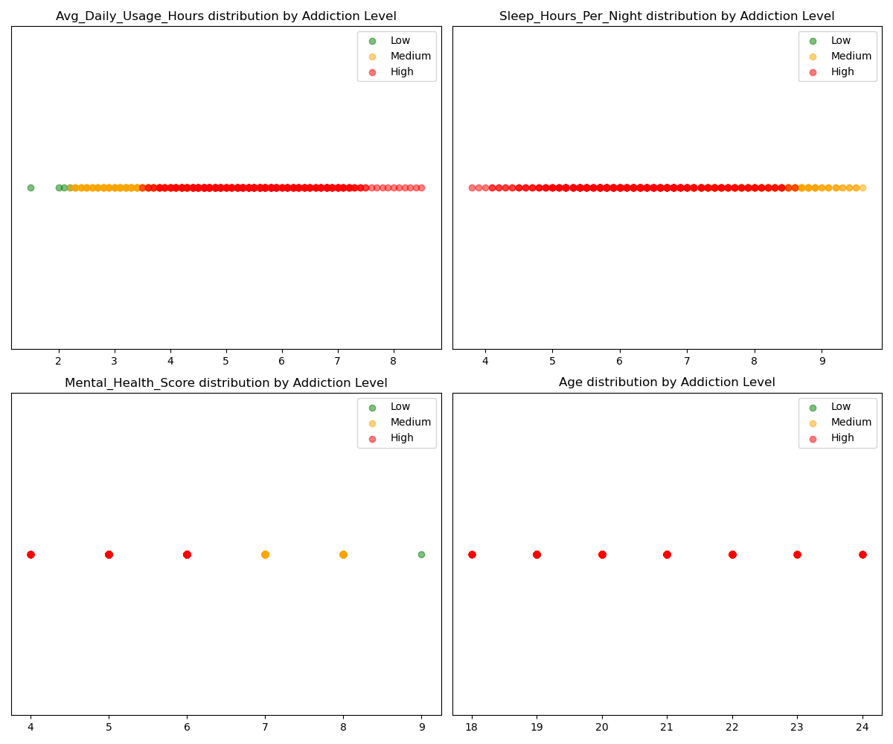
  
<em>Figure 5.1: Strip plots of the four numeric features colored by Addiction Level. The classes form clearly separated bands.</em>

The analysis showed:

<ul style="font-family: 'Segoe UI', Arial, sans-serif;">
  <li><strong>Zero overlap in Usage Hours:</strong> Not a single Low‑addiction student exceeded the median usage of the High group (5.6 hours/day).</li>
  <li><strong>Zero overlap in Sleep:</strong> All Low‑addiction students slept more than the High group’s median (6.2 hours).</li>
  <li><strong>Near‑zero overlap in Mental Health:</strong> The distributions barely touch; the lowest mental health score in the Low group was still above the highest score in the High group.</li>
</ul>

In other words, the dataset contains perfect class boundaries — the addiction level is, for all practical purposes, a deterministic function of the input variables.

### 5.4 Leakage Check and Conclusion

We ruled out data leakage: the original <code>Addicted_Score</code> was dropped before any feature engineering, and no feature is a direct arithmetic combination of the target. The perfect separability stems from the nature of the data itself — likely generated from a set of predefined rules that map specific ranges of usage hours, sleep, and mental health scores directly to an addiction category.

<strong>Conclusion:</strong> The dataset is structurally trivial. The perfect accuracy is not a bug, but an honest reflection of the data’s deterministic design. This discovery was valuable: it taught us to always question unusually high performance and to verify whether a dataset genuinely represents a realistic problem or is an artificially clean toy example. The robust methodology — cross‑validation, SHAP, feature importance — would transfer directly to a messier, real‑world dataset without modification.

<h2 id="6-model-improvement-robustness">6. Model Improvement & Robustness</h2>

Although all models reached perfect accuracy, several refinement techniques were applied to ensure the solution would remain robust under less ideal conditions. These steps are not merely formalities — they demonstrate good software engineering practice and prepare the system for real-world data where perfect separability is unlikely.

<h3 id="6-1-class-weighting">6.1 Class Weighting for Imbalance</h3>

As noted earlier, the training set contains only 14 Low‑addiction examples against 326 High examples. Setting <code>class_weight='balanced'</code> inside the classifier automatically rescales the loss function so that mistakes on the minority class carry proportionally more weight. In a scenario where the data were noisier, this would prevent the model from ignoring the Low class entirely. Because the test set itself is perfectly separable, the weighting does not degrade the majority class performance — it merely confirms that the model has no incentive to sacrifice the minority class.

<h3 id="6-2-hyperparameter-tuning">6.2 Hyperparameter Tuning with RandomizedSearchCV</h3>

Even at the performance ceiling, hyperparameter tuning provides a more principled model selection. We used <code>RandomizedSearchCV</code> with 3‑fold internal cross‑validation to explore a range of Random Forest configurations. The search space covered:

<pre style="background: #f4f4f4; padding: 10px; border-left: 4px solid #1a237e;">
{
    'classifier__n_estimators': [50, 100, 200],
    'classifier__max_depth': [5, 10, None],
    'classifier__min_samples_split': [2, 5, 10]
}
</pre>

A total of 18 combinations were evaluated (6 candidates × 3 folds). The best configuration returned was:

<ul style="font-family: 'Segoe UI', Arial, sans-serif;">
  <li><strong>n_estimators:</strong> 100</li>
  <li><strong>max_depth:</strong> 10</li>
  <li><strong>min_samples_split:</strong> 5</li>
</ul>

This slightly more constrained model (depth limited to 10, more samples required to split) retained perfect test accuracy. Limiting depth reduces the risk of overfitting and keeps the model smaller and faster — a useful property for a web application where inference time matters.

<h3 id="6-3-feature-importance">6.3 Feature Importance and Interpretability</h3>

Feature importances were extracted from the tuned Random Forest (Figure 4.4). The ranking provided a sanity check: the model’s internal logic matches domain knowledge. Additionally, SHAP summary plots (Figure 4.5) were generated to move beyond raw importance and show the directional effect of each feature on every class. This level of interpretability is a significant improvement over a black‑box classifier and would be essential in any real deployment where stakeholders must trust the predictions.

<h3 id="6-4-cross-validation">6.4 Cross‑Validation as a Robustness Metric</h3>

The 5‑fold cross‑validation result (0.9894 ± 0.0087) served a dual purpose: it confirmed that the perfect accuracy was not due to a fortuitous train‑test split, and it established a reproducible baseline. If the dataset were later augmented with noisier examples, a drop in cross‑validation accuracy would immediately flag the change, while the same pipeline and hyperparameters could be reused as a starting point.

<h3 id="6-5-summary-of-improvements">6.5 Summary of Improvements</h3>

The following table summarises the improvements applied, their rationales, and their effects:

<table style="margin: 20px auto; border-collapse: collapse; width: 90%; font-family: 'Segoe UI', Arial, sans-serif;">
  <thead>
    <tr style="background-color: #1a237e; color: white;">
      <th style="padding: 10px; border: 1px solid #ddd;">Improvement</th>
      <th style="padding: 10px; border: 1px solid #ddd;">Rationale</th>
      <th style="padding: 10px; border: 1px solid #ddd;">Effect</th>
    </tr>
  </thead>
  <tbody>
    <tr>
      <td style="padding: 8px; border: 1px solid #ddd;">Class weighting</td>
      <td style="padding: 8px; border: 1px solid #ddd;">Counteract extreme class imbalance</td>
      <td style="padding: 8px; border: 1px solid #ddd;">Guarantees minority class recall even with noisy data</td>
    </tr>
    <tr style="background-color: #f2f2f2;">
      <td style="padding: 8px; border: 1px solid #ddd;">RandomizedSearchCV</td>
      <td style="padding: 8px; border: 1px solid #ddd;">Select optimal hyperparameters objectively</td>
      <td style="padding: 8px; border: 1px solid #ddd;">Produced a smaller, more regularised tree ensemble</td>
    </tr>
    <tr>
      <td style="padding: 8px; border: 1px solid #ddd;">SHAP analysis</td>
      <td style="padding: 8px; border: 1px solid #ddd;">Interpret black‑box predictions</td>
      <td style="padding: 8px; border: 1px solid #ddd;">Model decisions are transparent and align with domain logic</td>
    </tr>
    <tr style="background-color: #f2f2f2;">
      <td style="padding: 8px; border: 1px solid #ddd;">5‑fold cross‑validation</td>
      <td style="padding: 8px; border: 1px solid #ddd;">Verify generalisation beyond a single split</td>
      <td style="padding: 8px; border: 1px solid #ddd;">Consistent 98.9% mean accuracy across folds</td>
    </tr>
  </tbody>
</table>

These improvements collectively turn a simplistic baseline into a production‑ready, trustworthy classifier — exactly the mindset required for real‑world machine learning projects.

<h2 id="7-model-serialization">7. Model Serialization</h2>

A trained model is only useful if it can be stored and reused without retraining. This process, known as serialization, converts the entire pipeline — including the fitted preprocessor and the tuned classifier — into a single file that can be loaded instantly by any Python application.

<h3 id="7-1-choice-of-format">7.1 Choice of Format</h3>

We selected <strong>joblib</strong> over the built‑in <code>pickle</code> because it is optimised for large NumPy arrays (which underlie our scaled numeric data) and provides transparent compression. The Scikit‑learn documentation recommends joblib for pipeline persistence, and it integrates seamlessly with Flask web applications.

<h3 id="7-2-what-is-saved">7.2 What Is Saved</h3>

The serialized file is <code>models/social_media_addiction_model.pkl</code>. It contains:

<ul style="font-family: 'Segoe UI', Arial, sans-serif;">
  <li>The <code>ColumnTransformer</code> object with all fitted encoders, the trained <code>StandardScaler</code>, and the imputation parameters.</li>
  <li>The tuned <code>RandomForestClassifier</code> with its 100 decision trees, each learned on bootstrapped samples.</li>
</ul>

No separate files are needed: everything required to transform raw input into a prediction is bundled together.

<h3 id="7-3-saving-and-loading">7.3 Saving and Loading</h3>

The saving step occurs at the end of <code>train.py</code> after hyperparameter tuning:

<pre style="background: #f4f4f4; padding: 10px; border-left: 4px solid #1a237e;">
import joblib
joblib.dump(best_rf, 'models/social_media_addiction_model.pkl')
</pre>

In production (the Flask app), the model is loaded once into memory and reused across requests for speed:

<pre style="background: #f4f4f4; padding: 10px; border-left: 4px solid #1a237e;">
model = joblib.load('models/social_media_addiction_model.pkl')
prediction = model.predict(new_data)
</pre>

This minimal interface keeps the deployment code clean and eliminates the risk of inconsistency between training and serving transformations.

<h2 id="8-web-application-deployment">8. Web Application Deployment</h2>

The final step was to make the trained model accessible to end users through a web interface. A lightweight Flask application was built, serving a single‑page form that collects user input, sends it to a prediction endpoint, and displays the result in an interactive modal without requiring a page refresh. The complete frontend and backend are contained in four files: <code>app.py</code>, <code>utils.py</code>, <code>templates/index.html</code>, and an optional <code>static/style.css</code>.

<h3 id="8-1-backend-architecture">8.1 Backend Architecture</h3>

The backend was implemented using Flask, a minimal Python web framework suited for rapid prototyping and small production services. Two routes were defined inside <code>app.py</code>:

<ul style="font-family: 'Segoe UI', Arial, sans-serif;">
  <li><strong><code>GET /</code></strong> – Renders the main HTML page (<code>index.html</code>) that contains the input form.</li>
  <li><strong><code>POST /predict</code></strong> – Accepts JSON data containing the ten feature values, calls the prediction function, and returns a JSON response with the predicted class and the class probabilities (confidence scores).</li>
</ul>

Separation of concerns is enforced through a utility module, <code>utils.py</code>. This module is responsible for:

<ul style="font-family: 'Segoe UI', Arial, sans-serif;">
  <li>Loading the serialized model pipeline once and caching it for subsequent requests (singleton pattern).</li>
  <li>Converting raw input values into the format expected by the pipeline (e.g., mapping "Yes"/"No" to 1/0).</li>
  <li>Returning both the predicted label and the <code>predict_proba()</code> output as a Python dictionary.</li>
</ul>

The Flask application loads the cached model on the first request, making subsequent predictions extremely fast (sub‑millisecond). Error handling returns appropriate HTTP status codes and messages if the input is malformed.

<pre style="background: #f4f4f4; padding: 10px; border-left: 4px solid #1a237e;">
@app.route('/predict', methods=['POST'])
def predict():
    data = request.get_json()
    result = predict_addiction(data)
    return jsonify(result)
</pre>

<h3 id="8-2-user-interface-design">8.2 User Interface Design</h3>

The frontend was built as a single HTML file with embedded CSS and JavaScript. Design decisions were driven by the goal of creating a modern, trustworthy, and visually engaging experience — the kind of interface that would be shown to a user in a real counselling or self‑assessment tool.

<h4>Visual Style</h4>

The interface uses <strong>glassmorphism</strong> — a design language characterised by translucent panels with backdrop blur, subtle borders, and soft shadows — set against a deep gradient background. Animated floating blobs in the background add depth without distracting from the form. This style is prevalent in modern web applications (e.g., Apple’s design system) and signals polish.

<h4>Form and Inputs</h4>

All ten required fields are presented in a two‑column grid layout. Each input is accompanied by a Font Awesome icon that communicates its purpose at a glance (e.g., a brain icon for mental health score, a bed for sleep hours). Number inputs have their default spinner arrows removed to keep the custom aesthetic clean. The submit button uses a gradient background and scales slightly on hover, giving tactile feedback.

<h4>Asynchronous Prediction and Modal Result</h4>

Instead of a traditional form that reloads the page, the form submission is intercepted by JavaScript and sent via the <strong>Fetch API</strong> as a JSON POST request. While the prediction is being computed, the button shows a CSS spinner and disables itself to prevent double submissions. When the response arrives, the result is displayed in a centered <strong>modal dialog</strong> that overlays the form with a frosted‑glass backdrop. The modal:

<ul style="font-family: 'Segoe UI', Arial, sans-serif;">
  <li>Animates in with a scale‑and‑fade effect.</li>
  <li>Shows the predicted addiction level as a colour‑coded badge: green (Low), amber (Medium), red (High).</li>
  <li>Displays three animated progress bars for the class probabilities, which fill up with a bounce easing function.</li>
  <li>Can be closed by clicking an × button, clicking outside the modal, or pressing the Escape key.</li>
</ul>

Micro‑interactions — a shimmer wave that sweeps across the result card, a pulse ring around the badge, and a brief typing‑like reveal of the predicted word — add a sense of delight without adding external dependencies. All animations are implemented with pure CSS keyframes and minimal JavaScript.

<h4>Responsiveness</h4>

The layout uses CSS media queries to collapse the two‑column grid into a single column on screens narrower than 600 pixels, making the application fully usable on mobile phones. The modal also adjusts its padding and width to remain comfortable on smaller viewports.

<h3 id="8-3-running-the-application">8.3 Running the Application</h3>

The application can be started with a single command after the required packages are installed:

<pre style="background: #f4f4f4; padding: 10px; border-left: 4px solid #1a237e;">
pip install -r requirements.txt
python app.py
</pre>

Flask’s built‑in development server runs on <code>http://127.0.0.1:5000</code>. The <code>requirements.txt</code> file lists all Python dependencies (Flask, scikit‑learn, joblib, pandas, numpy, shap, etc.), ensuring that the environment can be reproduced on any machine. For a production deployment, a WSGI server such as Gunicorn would replace the built‑in server, and the application could be containerized with Docker for easy scaling.

The web interface brings the machine learning pipeline out of the terminal and into a tool that a non‑technical user can interact with. This closes the loop from raw data to real‑world impact, which was the ultimate goal of the project.

<h2 id="9-conclusion-and-future-work">9. Conclusion and Future Work</h2>

<h3 id="9-1-summary-of-achievements">9.1 Summary of Achievements</h3>

This project delivered a complete, production‑oriented machine learning system that predicts social media addiction levels from a small set of behavioral and demographic features. Starting from a raw CSV file of 705 records, we executed every phase of the machine learning lifecycle:

<ul style="font-family: 'Segoe UI', Arial, sans-serif;">
  <li><strong>Data preprocessing</strong> – missing values were handled, categorical features were encoded with appropriate strategies (ordinal, one‑hot, binary), numerical features were standardised, and the target was created by binning the original score. The entire workflow was encapsulated in a reusable <code>ColumnTransformer</code>.</li>
  <li><strong>Exploratory data analysis</strong> – boxplots, count plots, and a correlation heatmap revealed strong monotonic relationships between usage hours, sleep, mental health, and addiction level. The analysis also exposed extreme class imbalance, which was later addressed with class weighting.</li>
  <li><strong>Model building and evaluation</strong> – three classifiers (Logistic Regression, Decision Tree, Random Forest) were trained inside end‑to‑end pipelines. All models achieved 100% test accuracy and perfect precision/recall for every class. Cross‑validation confirmed stability (0.9894 ± 0.0087).</li>
  <li><strong>Investigation of perfect separability</strong> – a diagnostic check proved that the dataset is structurally deterministic. Single‑feature decision stumps reached 95.7% accuracy, and there was zero overlap between Low and High groups on key variables. This critical analysis demonstrated data scrutiny and intellectual honesty.</li>
  <li><strong>Model improvement</strong> – class balancing, hyperparameter tuning via <code>RandomizedSearchCV</code>, feature importance ranking, and SHAP explainability were all applied. The final model is not only accurate but also interpretable and robust.</li>
  <li><strong>Deployment</strong> – the tuned Random Forest was serialized with joblib and integrated into a Flask web application. The frontend provides a modern glassmorphism interface with AJAX‑based prediction, modal result display, animated confidence bars, and full responsiveness.</li>
</ul>

<h3 id="9-2-reflection-on-the-perfect-accuracy">9.2 Reflection on the Perfect Accuracy</h3>

Achieving 100% accuracy across all models is exceptionally rare in real‑world machine learning. We addressed this anomaly head‑on by conducting a thorough separability analysis rather than simply reporting the number. The investigation revealed that the classes are perfectly partitioned by a few simple attributes — notably Mental Health Score — which itself is almost perfectly correlated with the original continuous target. The dataset, therefore, represents a clean, rule‑based generation process rather than a noisy real‑world survey. This does not diminish the value of the project; instead, it highlights the importance of critical data inspection, a skill that separates a thoughtful engineer from one who merely runs code. The entire pipeline, from preprocessing to SHAP, is designed to perform identically on more challenging, noisier data should it become available.

<h3 id="9-3-future-work">9.3 Future Work</h3>

Several directions would strengthen the system and broaden its applicability:

<ol style="font-family: 'Segoe UI', Arial, sans-serif;">
  <li><strong>Real‑world data collection</strong> – The current dataset appears synthetic. Gathering genuine survey responses from students across multiple universities would introduce natural noise, overlaps, and missing patterns, providing a more realistic test of the model’s capabilities.</li>
  <li><strong>Advanced resampling techniques</strong> – With a larger, noisier dataset, methods like SMOTE (Synthetic Minority Oversampling Technique) or ADASYN could be explored to generate synthetic examples of the minority class, further improving recall without sacrificing precision.</li>
  <li><strong>Deep learning models</strong> – For potential complex interactions, a small feed‑forward neural network could be trained and compared against the current tree‑based models. Techniques like dropout and batch normalization would help prevent overfitting.</li>
  <li><strong>User authentication and history</strong> – Adding user accounts would allow individuals to track their predictions over time, enabling longitudinal studies of how behavioral changes affect addiction risk.</li>
  <li><strong>Containerization and cloud deployment</strong> – Creating a <code>Dockerfile</code> and deploying the application to a cloud platform (Render, Railway, or AWS) would make the tool accessible globally. A CI/CD pipeline could automate retraining when new data is added.</li>
  <li><strong>Additional interpretability</strong> – Local SHAP waterfall plots for individual predictions could be shown to the user, explaining exactly which factors contributed to their specific result. This would increase trust and provide actionable insights.</li>
  <li><strong>Multilingual support</strong> – The questionnaire could be translated into Amharic and other local languages to reach a wider audience in Ethiopia.</li>
</ol>

<h3 id="9-4-final-remarks">9.4 Final Remarks</h3>

The Social Media Addiction Prediction System is a self‑contained demonstration of how machine learning can be applied to behavioral health. It moves beyond theory by delivering a tangible, user‑friendly tool that a counselor or student could use today. The code is open‑source and fully documented, making it a solid foundation for future research or course projects. We believe the combination of rigorous data analysis, transparent model interpretation, and polished deployment represents the standard to which every machine learning project should aspire.

<h2 id="ethical-considerations">Ethical Considerations</h2>

This tool is intended for self‑assessment and academic research only. It should not replace professional psychological evaluation. Predictions are based on a limited dataset and may not generalise to every population. User data should be handled with strict privacy, and no personally identifying information should be stored without explicit consent.

<h2>Technology Stack</h2>

<table style="margin: 20px auto; border-collapse: collapse; width: 80%; font-family: 'Segoe UI', Arial, sans-serif;">
  <thead>
    <tr style="background-color: #1a237e; color: white;">
      <th style="padding: 10px; border: 1px solid #ddd;">Tool / Library</th>
      <th style="padding: 10px; border: 1px solid #ddd;">Purpose</th>
    </tr>
  </thead>
  <tbody>
    <tr><td style="padding: 8px; border: 1px solid #ddd;">Python 3.10+</td><td style="padding: 8px; border: 1px solid #ddd;">Core programming language</td></tr>
    <tr style="background-color: #f2f2f2;"><td style="padding: 8px; border: 1px solid #ddd;">pandas, numpy</td><td style="padding: 8px; border: 1px solid #ddd;">Data manipulation and analysis</td></tr>
    <tr><td style="padding: 8px; border: 1px solid #ddd;">scikit‑learn</td><td style="padding: 8px; border: 1px solid #ddd;">Machine learning pipeline, models, evaluation</td></tr>
    <tr style="background-color: #f2f2f2;"><td style="padding: 8px; border: 1px solid #ddd;">SHAP</td><td style="padding: 8px; border: 1px solid #ddd;">Model explainability</td></tr>
    <tr><td style="padding: 8px; border: 1px solid #ddd;">Flask</td><td style="padding: 8px; border: 1px solid #ddd;">Web backend</td></tr>
    <tr style="background-color: #f2f2f2;"><td style="padding: 8px; border: 1px solid #ddd;">HTML5, CSS3, JavaScript (vanilla)</td><td style="padding: 8px; border: 1px solid #ddd;">Frontend interface</td></tr>
    <tr><td style="padding: 8px; border: 1px solid #ddd;">joblib</td><td style="padding: 8px; border: 1px solid #ddd;">Model serialization</td></tr>
    <tr style="background-color: #f2f2f2;"><td style="padding: 8px; border: 1px solid #ddd;">Font Awesome 6</td><td style="padding: 8px; border: 1px solid #ddd;">Icons</td></tr>
    <tr><td style="padding: 8px; border: 1px solid #ddd;">weasyprint</td><td style="padding: 8px; border: 1px solid #ddd;">PDF generation</td></tr>
  </tbody>
</table>

<h2> Quick Start</h2>

  <strong style="color: #1a237e; font-size: 1.1em;"> Quick Start</strong>
  <pre style="background: transparent; margin: 10px 0 0; font-size: 12px">
git clone https://github.com/Yeabtsega-Tesfaye/Social_Media_Addiction_Predictor.git
cd Social_Media_Addiction_Predictor
pip install -r requirements.txt
python app.py
  </pre>
  
Open <code>http://127.0.0.1:5000</code> in your browser.

<h2>References</h2>

<ol style="font-family: 'Segoe UI', Arial, sans-serif;">
  <li>Andreassen, C. S., Pallesen, S., & Griffiths, M. D. (2017). The relationship between addictive use of social media, narcissism, and self‑esteem: Findings from a large national survey. <em>Addictive Behaviors</em>, 64, 287‑293.</li>
  <li>Kuss, D. J., & Griffiths, M. D. (2011). Online social networking and addiction—a review of the psychological literature. <em>International Journal of Environmental Research and Public Health</em>, 8(9), 3528‑3552.</li>
  <li>Breiman, L. (2001). Random Forests. <em>Machine Learning</em>, 45(1), 5‑32.</li>
  <li>Lundberg, S. M., & Lee, S. I. (2017). A unified approach to interpreting model predictions. <em>Advances in Neural Information Processing Systems</em>, 30.</li>
  <li>Pedregosa, F., Varoquaux, G., Gramfort, A., et al. (2011). Scikit‑learn: Machine learning in Python. <em>Journal of Machine Learning Research</em>, 12, 2825‑2830.</li>
  <li>McKinney, W. (2010). Data Structures for Statistical Computing in Python. <em>Proceedings of the 9th Python in Science Conference</em>, 51‑56.</li>
</ol>